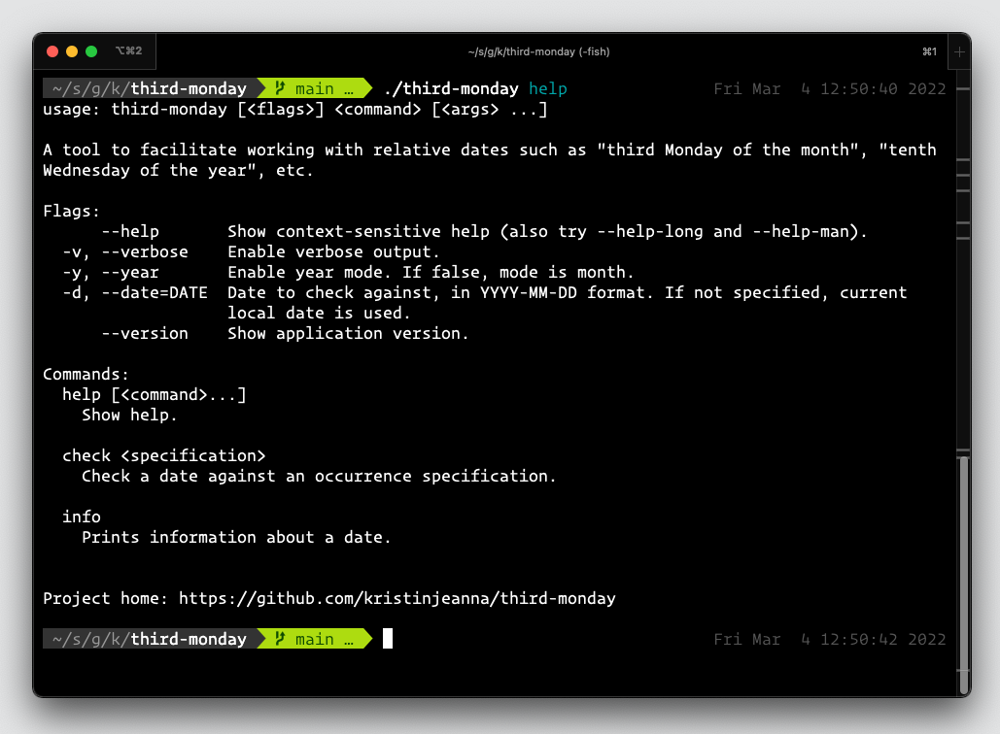
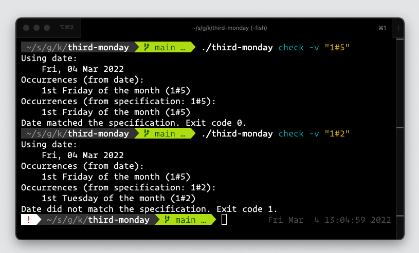

# third-monday

[](https://github.com/kristinjeanna/third-monday/blob/main/LICENSE) 

A tool to facilitate working with relative dates such as "third Monday of the month", "tenth Wednesday of the year", etc.

This tool was born of a need I had to run a cron job on the third Monday of every month. Crontab syntax does not allow for this, hence the creation of a utility that I could include in the crontab to only run a desired command if `third-monday` returned an exit code of 0, based on a provided date specification.

- [Usage](#usage)
- [Date specification](#date-specification)
- [Crontab example](#crontab-example)

## Usage



The following screenshot shows the tool being used to check the current date against two different date specifications: (1), `1#5`, "the first Friday of the month", and (2) `1#2`, "the first Tuesday of the month".

Note that the second date specification returned a non-zero exit code since Friday, March 4, 2022 is not the first Tuesday of the month.



## Date specification

The date specification consists of two parts separated by a "#" symbol. The first part indicates "first", "second", "third", etc. and corresponds to ordinals returned by the [`time#Time.Day()`]([https://link](https://pkg.go.dev/time#Time.Day)) function (or by the [`time#Time.YearDay()`]([https://link](https://pkg.go.dev/time#Time.YearDay)) function if the `--year` flag is specified). The second part indicates the day of the week: "Monday", "Tuesday", "Wednesday", etc. and corresponds to ordinals returned by the [`time#Time.Weekday()`]([https://link](https://pkg.go.dev/time#Time.Weekday)) function.

Each part of the date specification may possess more than one ordinal. A list of ordinals consists of ordinals separated by commas. Examples:

- `1,3#0` - "the first and third Sundays of the month"
- `2#2,5` - "the second Tuesday and the second Friday of the month"
- `1,2#1,6` "the first and second Mondays and Saturdays of the month"

An additional flag, `--year` allows you specify days in the year such as `14#2` or "the fourteenth Tuesday of the year.

**Note:** *I should add that this tool currently lacks any checks for absurd specifications like "the fifteenth Tuesday of the week" or "the five-hundreth Friday of the year". So YMMV.*

## Crontab example

Suppose, for example, I want to run a cron job that executes a command called `helloworld` on the second Tuesday and second Thursday of each month at 9:30am, the corresponding crontab item would be:

```crontab
30 9 * * * third-monday check "2#2,4" && helloworld >/dev/null 2>&1
```

Essentially, the cron will fire every day at 9:30am but `helloworld` will only be executed on the second Tuesday and second Thursday of each month.
